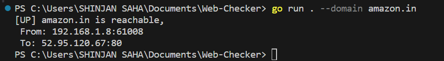

# Web-Checker-Using-Go

This is a CLI tool that checks the health of a website, determining whether it is up or down.

## Commands to Run

To check the health of a website, use the following command:

```bash
go run . --domain amazon.in
```

we can give any other domain name of our choice like google.com

## Working img
